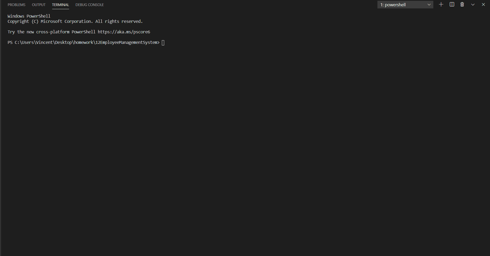

[](https://www.npmjs.com/package/inquirer)

[](https://www.npmjs.com/package/console.table)
 

# 12EmployeeManagementSystem

## Description 
An app that allows a user to view, add, update, and delete a company employee database.

# Table of Contents 
- [Front End](#FrontEnd) 
- [Features](#Features) 
    - [Functions in app.js](#Functionsinapp.js)
        - [Imports and Queries](#ImportsandQueries)
        - [Connection](#Connection)
        - [Start, Main Menu, Next, and Exit](#Start,MainMenu,Next,andExit)
        - [QueryTable](#QueryTable)
        - [View Functions](#ViewFunctions)
        - [Add Functions](#AddFunctions)
        - [Update Functions](#UpdateFunctions)
        - [Delete Function](#DeleteFunction)
        - [USDformatter](#USDformatter)
- [Installation](#installation) 
- [Usage](#usage) 
- [Contribution](#contribution) 
- [Tests](#tests) 
- [License](#license) 
- [Questions](#questions) 

## Front End

There is a front end version of this application that I made where you may view as an extra. I decided to build a front end version of this app to further learn and experiment with Express.js, MySQL, and Node.js. In the front end version, the user may only view the information on the database and filter through employees; they cannot add or delete employees, roles, or departments. 

To see the front end deployed on Heroku, see the following link:

[Heroku Deployed Front End](https://vinces-employee-management-sys.herokuapp.com/)

To see the GitHub of the front end see the following link:

[GitHub Front End](https://github.com/vmcgargill/HerokuEmployeeMGMTSYS)

To see a YouTube video of a demonstration of the front end version:

[YouTube Front End](https://www.youtube.com/watch?v=JHDxZpB4bJ8)

Also, see the gif of the front end in use:



## Features

The backend of this application is all in the app.js file. The user interacts with this application via inquirer.js and uses console.table to display the information in a user friendly data table format. This application can do the following:

- View details of a specific employee
- View all employees in the database
- View all departments in the database
- View all roles in the database
- View all roles that are under a specific department (for example, the production department would display the following roles: Production Associate, Customer Service Represenative, and Order Specialist.
- View all employees with a specific role. For example, if you view by sales represenative then it will display all of the employees with the sales represenative role.
- View all employees in a specific department. For example, if you view by the Production Department then it will display all employees with a role that is assigned to the production department.
- View employees by manager, this feature lets you select a manager and then it deiplays all of the employees who are managed by that person.
- View total utilized budget of the entire company, this feature takes all of the employees' salaries and adds them up for a lump sum. This lump sum is the utilized budget for the entire company.
- View utilized budget by department, this feature takes all of the employees within a specific department and adds up all of their salaries, which gives us the utilized budget of that department.
- View utilized budget by role, this feature takes all of the employees under a specific role and adds up all of their salaries, which gives us the utilized budget of that role.
- Add an employee to the database
- Add a role to the database
- Add a department to the database
- Update an employee in the database by first name, last name, role, or manager.
- Update a role in the database by title, department, or salary.
- Update a department in the database by name
- Delete an employee in the database
- Delete a role in the database
- Delete a department in the database

See the following link for a YouTube video demonstrating this application in use:

[YouTube Back End](https://www.youtube.com/watch?v=CUXbosrJf6s)

You may also see the gif of this app in action:


### Functions in app.js
This section contains information about the functions used in the app.js file to create this app and make it interactive so the user may view, add, update, and delete tables in the employee_db database.

#### Imports and Queries
At the top of the page you can see that the app first imports inquirer.js, console.table, and MySQL which are all essential to the functionality of this application.

After that, you can see a few MySQL query strings such as EmployeeTableQuery, DepartmetnQueryAll, or ManagerTableQuery. These a generic MySQL queries that we are going to use throughout the application.

#### Connection
At line 44 you can see the constant "connection" being defined, which creates a MySQL connection to the database. You may change the user name or password to whatever it is you use on your local PC. At line 53 is when we initially connect to the database and initialize the start function.

#### Start, Main Menu, Next, and Exit
The functions seen from line #59 to line #140 are the bare bones of the application.
- Start is a function used only at the very beginning when the user first enters the command "npm start". I simply console logs a welcome message and then initializes the MainMenu function for the very first time.
- The MainMenu function of this app presents a inquirer.js list where the user may select what they would like to do. The user may return to this menu any time they would like after the complete a task or cancel from a task.
- The Next function is used the most frequenly out of all of the functions as this page, as it askes the user what they would like to do after completeing a task. For example, after the user views all employees in the database, they are then prompted to ask what they would like to do next. The user has two options in this menu: "Return to Main Menu" which when selected, it will run the MainMenu function, and then "Exit" which will run the Exit function when selected.
- Just like the start function, the exit function is incredibly simpla as all it does is console log a goodbye message and then ends the connection to the database. After this happends, the user is no longer prompted any more inquirer messages.

#### QueryTable
The QueryTable function is a very simple function that takes in a query string used to query items in the MySQL database and then generates a table using console.table and displays that information to the user in a friendly format. The console.table is a NPM package that takes in an array of information, in this case an array queried from the database, and then displays that information in a neat table that can be logged in the console.

After logging this table, it initializes the Next function to see if the user would like to exit or return to the main menu. This function is often used at the end of a View function where the user is viewing information stored in the database. It also can be seen used after the user creates or updates a employee, role, or department to show the created/updated information. It is not used in the delete functions as those function do not add or update any items on the database.

#### View Functions
The view functions let the user view information stored in the database. This group of functions include: ViewBy, ViewSpecificEmployee, ViewAllEmployees, ViewAllDepartments, ViewAllRoles, ViewRolesByDepartment, ViewEmployeesByRole, ViewEmployeesByDepartment, ViewEmployeesByManager, ViewUBDepartment, ViewUBRole, and ViewTotalUB. The titles in these functions are pretty self explanitory. For example: ViewAllDepartments allows the user to view all departments. I won't get into too much detail of what all of these do, instead I want to focus on the ViewBy function. 

The ViewBy function takes in a very generic request where the user wants to view a data set based on a few properties. The purpose of this function is to make the code less repetative with all of the view by functions. Otherwise all of the view by functions would all look the same, and they would take up even more lines of code. The view by function takes in very generic viewing functions so that less lines of code are used. 

ViewBy passes in 3 variables. The first variable is called SelectQuery which is a MySQL query string the gathers a list of items they want to view by. For example, if the user wants to view employees by department, this string would query all departments so we can then use that list of departments in a inquirer.js list. 

The second item passed through this function is the PromptMsg variable which is simply a string that is a message for inquirer.js to use to present the user. For example: "Please select a department to view all employees by" is a PromptMsg.

The third item that is passed through is the TableQuery variable which lets the ViewBy function know who to handle the data that is being queries. That way it knows to create a new array of Employees/Managers by their first and last names or it knows to sort through an array of roles by their title. This variable also decided how the SelectionQuery variable will be changed or if it is used at all. The SelectionQuery variable is simply another MySQL query that simply gets the data that the user has requested for. If the user is viewing the budget of a department or role, then this variable is not used.

The ViewBy function is utilized by ViewSpecificEmployee, ViewRolesByDepartment, ViewEmployeesByRole, ViewEmployeesByDepartment, ViewEmployeesByManager, ViewUBDepartment, and ViewUBRole. It is not used by ViewTotalUB, ViewAllEmployees, ViewAllDepartments, or ViewAllRoles because those requests are a lot simpler to handle, it does not require the user to select from a list of items to view by since they are selecting all items in a database.

#### Add Functions
The add functions include AddEmployee, AddDepartment, and AddRole. It is pretty straighforward, these functions allow you to add an employee, a role, or a department to the database. They do have some constraints that the user must abide by. For example, if the user tries to create a department with the same name of another department that already exists, then it stops the user and makes them try again with a unique name. This applys to employee_role titles and creating employees with the same exact first and last name. This will prevent a bug in the ViewBy function where if the user selects an employee with the same name as another employee, then it might get the wrong employee ID. Thus getting the wrong information. This also makes the database easier to view as there will be less confusion which employee is which. Also, there whould not be duplicate departments or roles. 

These functions each have their own unique features. For example, create department makes sure you aren't creating a duplicate department, create role makes sure you aren't creating a duplicate role as well as it makes sure the salary you are entering into the database is an integer, and create employee makes sure you are creating an employee with a unique first and last name.

#### Update Functions
The update functions work very similarly to the add functions and they consist of UpdateEmployee, UpdateDepartment, and UpdateRole. Except for they allow the user to update the information of an object that is already currently on the database. It first presents the user an inquirer list of all the avilable items they can update. After the user selects an item to update, then it gives them another list of features they can update by. For example, for employees the user has the uption to update first name, last name, manager, or role. For role, the user has the option to update the title, salary, or department, For department, the user can only update the name of the department, as there is nothing else to update. 

The update functions follow the same constraints that the add functions abide by. For example, the name/title of the employee/department/role must be unique. Also, the use must inter an integer to update a role salary.

#### Delete Function
The delete functions allow the user to delete employees/roles/departments from the database and they consist of DeleteEmployee, DeleteDepartment, and DeleteRole. Each function first starts off by presenting a inquirer list of items the user gets to select from to delete. Again, these functions are pretty straightforward. These functions also check if other tables have rows that are dependant on that item the user tries to delete. For example, if the user tries to delete an employee that is the manager of another employee, then it prevents the user from doing so and tells them to reassign managers first. If the user tries to delete a department that is already assigned to a role, then it tells you to reassign roles. If the user tries to delete a role that is assigned to an employee, then it will tell you to reassign the employees role first. It does this by checking the ID of the item the user wants to delete, then it checks the database if that ID is assigned to any sub rows of another table, for example manager_id, role_id, and department_id. This feature was implemented to prevent bugs and to demonstrate how to create delete errors so the user does not delete something important by mistake.

#### USDformatter
The USD formater is a JavaScript formater that takes in an integer and returns it in a currency format. This is primarily used for viewing the budgets for a department, role, or company. For example, if you input 6000 it will return $6,000.00.

## Installation 
To install, run the following command:

```
npm i
```

Also, be sure to query the code in MySQL in the DB.sql file. You can do this by using a tool such as MySQL Workbench. Or you can do if via command line with the following instructions:

First, open the directory in the command prompt and run the following command:

```
mysql -u root -p
```

If you are loggin in from a different user, replace root with whatever your user name is. Once you have started the mysql command line tool the run the following command:

```
source DB.sql
```

If no errors have occured then you has succesfully queried the database information.

## Usage
Used for viewing or updating a employee database.

## License 
This application is covered by: NPM Inquirer Package
 
## Contribution 
See contact information in the questions section of this README.md
 
## Tests

```
node app.js
```
 
## Questions 
If you have any questions feel free to contact: 
 
[GitHub](https://github.com/vmcgargill) 
 
Email: [vincentmcgargill@gmail.com](mailto:vincentmcgargill@gmail.com)